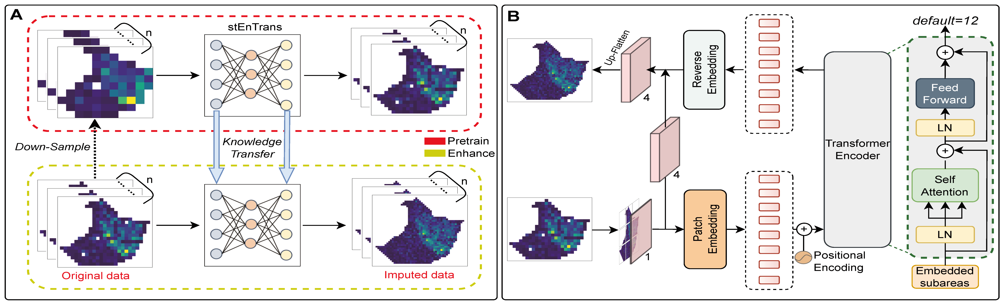

# SpaViT
## Overview
The spatiotemporal specificity of gene expression highlights the importance of integrating cellular spatial information to better understand the specific functions of cells within tissues. However, widely used ST techniques are frequently limited by low resolution, potentially hindering researchers from fully understanding gene expression patterns, cell type distribution, and their interactions. SpaViT is a self-supervised method based on the Transformer architecture for predicting high-resolution gene expression. SpaViT leverages customized self-supervised proxy tasks to learn the continuous patterns of gene expression within tissues and predicting high-resolution gene expression profiles. Additionally, SpaViT enhances the spatial patterns of gene expression, aiding researchers in identifying biologically significant differentially expressed genes and pathways.

## Installations
- NVIDIA GPU (a single Nvidia GeForce RTX 3090)
- `pip install -r requiremnt.txt`

## Data
All the datasets used in this paper can be downloaded from url：[https://zenodo.org/records/14160324](https://zenodo.org/records/14160324).
### Data format
SpaViT only requires the gene expression data and the two-dimensional spatial locations of all spots, and does not require data such as histological images.
For example, we need the gene expression `filtered_feature_bc_matrix.h5` and the spatial coord `tissue_positions_list.csv`.

## Running demo
We provide a examples for recoving high-resolution gene expression data of 10X Visium human dorsolateral prefrontal cortex tissue, please refer to [demo_DLPFC.py](demo_DLPFC.py).

## Contact details
If you have any questions, please contact xueshuailin@163.com.
